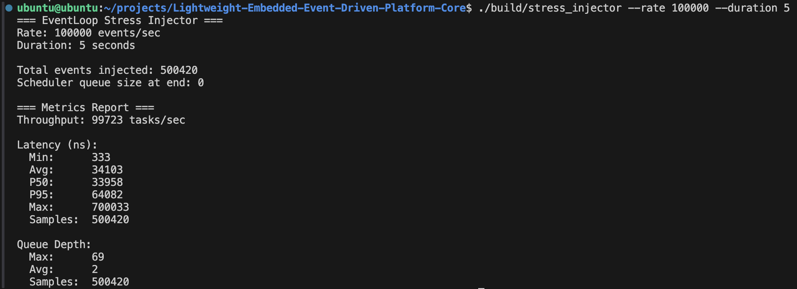

# Lightweight-Event-Driven-Platform-Core

1. Designed and implemented a lightweight event-driven platform in C++17, simulating RTOS-like interrupt handling and deterministic dispatch under constrained resources.

2. Built a modular architecture to support task registration, event routing, timer-driven triggers, and simulated hardware interrupts.

3. Implemented a priority-based scheduler with starvation prevention to ensure fair and predictable task execution.

4. Developed performance instrumentation to measure scheduling latency, achieving ~100k tasks/sec throughput on a 4-core system with P95 latency of 64µs and worst-case latency under 1ms.

